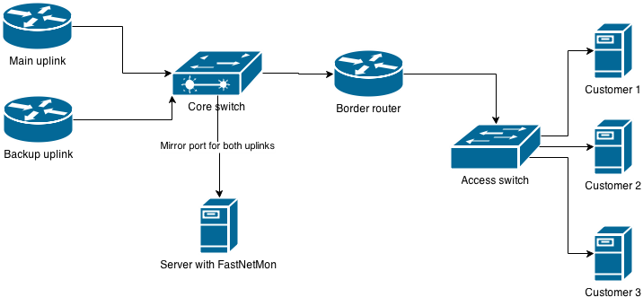

FastNetMon
===========
Author: [Pavel Odintsov](http://ru.linkedin.com/in/podintsov/) pavel.odintsov at gmail.com [Follow my Twitter](https://twitter.com/odintsov_pavel)

Join to [maillist](https://groups.google.com/forum/#!forum/fastnetmon) Look at [road map](docs/ROADMAP.md)

License: GPLv2

FastNetMon - A high performance DoS/DDoS load analyzer built on top of multiple packet capture engines (NetFlow, IPFIX, sFLOW, netmap, PF_RING, PCAP).

What can we do? We can detect hosts in our own network with a large amount of packets per second/bytes per second or flow per second incoming or outgoing from certain hosts. And we can call an external script which can notify you, switch off a server or blackhole the client.

- [Binary rpm packages for CentOS 6/7 and Fedora 21](docs/INSTALL_RPM_PACKAGES.md)
- [Automatic install script for Debian/Ubuntu/CentOS/Fedora](docs/INSTALL.md)
- [Manual install on FreeBSD and Dragonfly BSD](docs/FreeBSD_INSTALL.md)
- [Manual install on Mac OS X](docs/MAC_OS_INSTALL.md)
- [Manual install on Slackware](docs/SLACKWARE_INSTALL.md)
- [Manual install for VyOS](docs/VyOS_INSTALL.md)
- You could order VPS with preinstalled FastNetMon: http://vps2fast.com/vds/

  

Supported packet capture engines:
- NetFlow v5, v9
- IPFIX
-  v5
- Port mirror/SPAN capture with PF_RING (with ZC/DNA mode support [need license](http://www.ntop.org/products/pf_ring/)), NETMAP and PCAP

You could look [comparison table](https://github.com/FastVPSEestiOu/fastnetmon/blob/master/docs/CAPTURE_BACKENDS.md) for all available packet capture engines.

Features:
- Can process incoming and outgoing traffic
- Can trigger block script if certain IP loads network with a large amount of packets/bytes/flows per second
- Could [announce blocked IPs](docs/EXABGP_INTEGRATION.md) to BGP router with [ExaBGP](https://github.com/Exa-Networks/exabgp)
- netmap support (open source; wire speed processing; only Intel hardware NICs or any hypervisor VM type)
- Supports L2TP decapsulation, VLAN untagging and MPLS processing in mirror mode 
- Can work on server/soft-router
- Can detect DoS/DDoS in 1-2 seconds
- Tested up to 10GE with 5-6 Mpps on Intel i7 2600 with Intel Nic 82599
- Complete plugin support
- Could [complete support](docs/DETECTED_ATTACK_TYPES.md) for most popular attack types

Supported platforms:
- Linux (Debian 6/7/8, CentOS 6/7, Ubuntu 12+)
- FreeBSD 9, 10, 11
- Mac OS X Yosemite 

What is "flow" in FastNetMon terms? It's one or multiple udp, tcp, icmp connections with unique src IP, dst IP, src port, dst port and protocol.

Main program screen image:

Example for cpu load on Intel i7 2600 with Intel X540/82599 NIC on 400 kpps load:

Example deployment scheme:

Example of [notification email](docs/ATTACK_REPORT_EXAMPLE.md) about detected attack.

To enable sFLOW simply specify IP of server with installed FastNetMon and specify port 6343.
To enable netflow simply specify IP of server with installed FastNetMon and specify port 2055.

Why did we write this? Because we can't find any software for solving this problem in the open source world! 

How I can help project?
- Test it! 
- Share your experience
- Share your improvements
- Test it with different equipment
- Create feature requests
